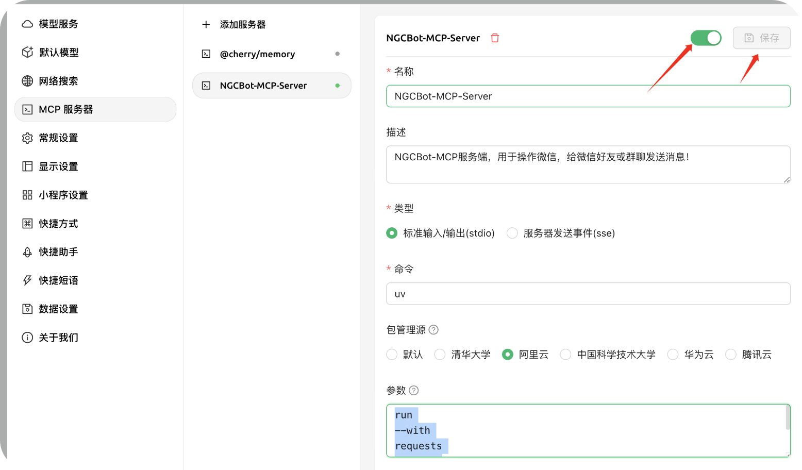
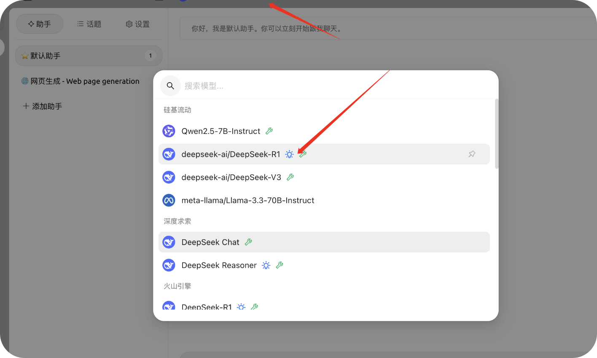

<h3 align="center">
NGCBot-MCP-Server
</h3>


<h5 align="center">
一个基于✨HOOK机制的微信机器人，支持🌱安全新闻定时推送【FreeBuf，先知，安全客，奇安信攻防社区】，👯Kfc文案，⚡漏洞查询，⚡手机号归属地查询，⚡知识库查询，🎉星座查询，⚡天气查询，🌱摸鱼日历，⚡微步威胁情报查询，
🐛视频，⚡图片，👯帮助菜单。📫 支持积分功能，⚡支持自动拉人，，🌱自动群发，👯Ai回复，⚡视频号解析，😄自定义程度丰富，小白也可轻松上手！已支持MCP~
</h5>
<div style="text-align: center">
    <a href="http://ngc660.cn">
        
    </a>
    
  <a rel="nofollow" href="https://gitcode.com/ngc660sec/NGCBot">
    
  </a>
    
    
    
</div>

## 💫 一、使用指南
1. 必须使用 V2.3 新版NGCBot，并开启API接口
2. 必须使用 `uv`环境

**注意：此文档配合以下视频使用更佳！**

视频链接：https://www.bilibili.com/video/BV1GTdeYaEsE/


### 1.1、第一步：安装 UV
UV的安装：https://www.cnblogs.com/wang_yb/p/18635441

看教程安装即可，如果你跟主播一样用的 MAC

那么输入以下命令即可
```
brew install uv
```

### 1.2、第二步：下载 Cherry Studio 或者 Claude
建议使用 Cherry Studio 

官方地址：https://cherry-ai.com/download


### 1.3、第三步：配置 Cherry Studio
点击此链接注册：https://cloud.siliconflow.cn/i/M3ytr9bQ
获取Key 然后配置


### 1.4、第四步：下载 NGCBot-MCP-Server

官方地址：https://github.com/ngc660sec/NGCBot-MCP


### 1.5、第五步：Cherry Studio 配置 NGCBot-MCP-Server

在 config.py 文件中配置 API 和 Key


### 1.6、第六步：配置 NGCBot-MCP


相关配置：

```
NGCBot-MCP-Server

NGCBot-MCP服务端，用于操作微信，给微信好友或群聊发送消息！

uv

run
--with
requests
fastmcp
run
/Users/exm/Python/MCP/NGCBot-Mcp-Server/main.py

```



发现绿色的图标，那么就是启动成功！

### 1.7、第七步：使用NGCBot-MCP-Server


配置硅基流动的模型



相关效果演示：


## 💰 二、会员群聊处

**前言**：在项目更新的过程中发现许许多多的同学不会配置项目，也有许多的同学想要接入自己的API但又没学过 `Python` 。所以今天（2024,12,04）宣布建立会员交流群，主要解决以下几个问题：

1. 不会配置项目，不会启动项目
2. 接入API问题，不会接入自己的API
3. 想要实现自己的功能，比如（客服）
4. 等等... ...

进入付费群聊后会在群内进行指导必要时可提供远程协助，另外会开设特定课程如：Python基础课程，机器人使用教程（视屏），API接入课程（指南），等等(还没想好)

另外还会发布机器人+其它大模型的结合使用教程

价格暂定：（**99**）

付费时效：**终生**

联系方式：

<div style="display: flex;">
  
</div>
